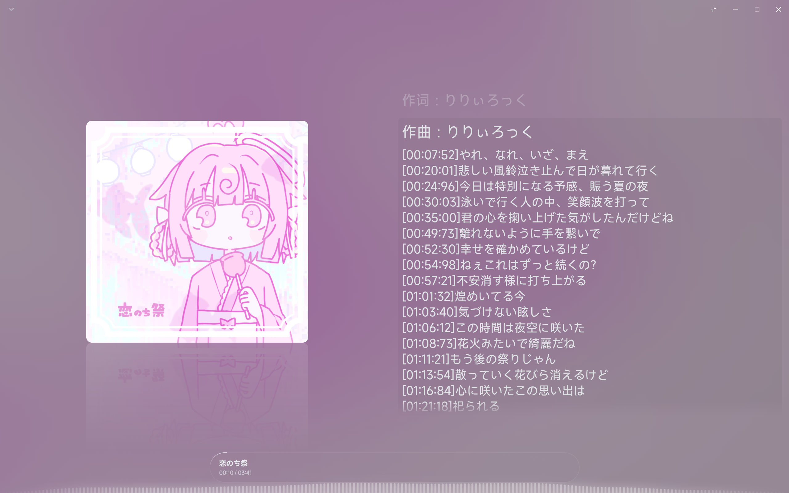
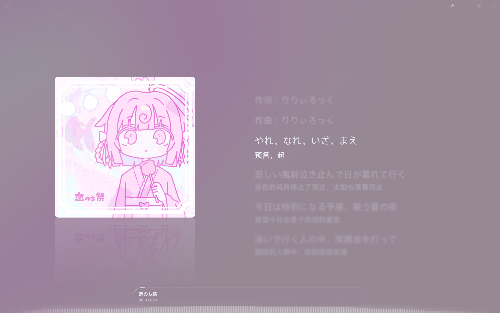

# Salt Player 歌词同步兼容模组

让部分 FLAC 音乐文件中“能看到歌词，却不能跟着音乐高亮、滚动”的内嵌歌词恢复同步。

## 解决什么问题？

有些歌曲已经内嵌了带时间标记的歌词，但播放器把 `[00:07:52]` 这样的标记当成普通文字显示，无法用它确定每句歌词的播放时间。

### 修复前：时间标记直接显示，歌词无法同步

### 修复后：时间标记隐藏，当前歌词恢复高亮

以上是同一首歌的效果对比。静态截图展示显示效果；播放时的同步高亮和滚动已在 Windows 1.18.5 中验证，详见 [验证记录](docs/VALIDATION.md)。

### 为什么会这样？

部分歌词用冒号分隔秒数和小数部分，而当前已验证的播放器版本能识别点号写法。例如，下面两个标记都表示 **1 分 2.61 秒**：

| 歌词中的写法 | 在已验证的播放器版本中 |
| --- | --- |
| `[01:02:61]示例歌词` | 时间标记被当成文字显示 |
| `[01:02.61]示例歌词` | 可以识别时间，随播放同步显示 |

本模组在读取歌词时，将能确认含义的冒号标记转换成点号写法，再交给播放器。**不会改写音乐文件、标签、封面或音频数据，使用时无需联网。**

冒号写法并不一定是写错了：[Sony 的官方说明](https://helpguide.sony.net/gbmig/42708101/v1/eng/contents/03/03/11/11.html)就支持这种格式。这是不同播放器的兼容性差异。

## 下载与使用

### 第一步：下载安装包

**[下载 v0.1.0 模组安装包（ZIP）](https://github.com/sh1robana/salt-lyric-compat/releases/download/v0.1.0/plugin-local.salt.lyriccompat-0.1.0.zip)**

下载后得到 `plugin-local.salt.lyriccompat-0.1.0.zip`，**保留 ZIP 文件，不要解压**。

也可以打开 [版本发布页](https://github.com/sh1robana/salt-lyric-compat/releases/tag/v0.1.0)，在“附件”（Assets）里下载这个文件。带 `source` 的压缩包，以及“源码”（Source code）或“代码 → 下载 ZIP”（Code → Download ZIP），都不是模组安装包。

### 第二步：导入并启用

1. 打开 Windows 版 Salt Player，进入 **设置 → 创意工坊 → 模组管理**。
2. 点击页面右上角的 **导入**图标，选择刚下载的 ZIP 文件。
3. 找到 **FLAC Lyric Timestamp Compatibility**，点击这一行右侧的向下箭头，选择 **启用**，按提示确认。
4. 状态显示 **已启动（STARTED）** 后，先切换到另一首歌，再切回原本有问题的歌曲。若提示重启，先重启播放器。

现在打开歌词页面，检查时间标记是否隐藏、当前歌词是否跟着音乐高亮和滚动。

> v0.1.0 安装包在播放器中仍显示上面的英文名称，按这个名称查找即可。普通用户无需运行仓库里的脚本。

### 第三步：需要时禁用

在 **模组管理**里点击模组右侧的向下箭头，选择 **禁用**，再重新打开歌曲，即可恢复播放器原来的处理方式。

## 哪些情况适用？

| 项目 | 当前支持情况 |
| --- | --- |
| Windows 版 Salt Player 1.18.5 | 已验证导入、启用、重启和实际播放 |
| 其他 Windows 版本、Linux 版 | 尚未验证 |
| 安卓版 | 当前安装包不适用 |
| FLAC 内嵌歌词中的冒号时间标记 | 在能确认含义时转换 |
| MP3、WAV 等其他音频格式 | 当前模组不处理 |
| 同目录中的同名外置歌词文件 | 交回播放器默认处理 |

这不是通用的歌词修复工具。如果标记可能表示“时:分:秒”，或转换后的时间明显超出歌曲时长，模组会保留原样，避免误改。

## 常见问题

**启用后还是没有同步？**

先确认状态为“已启动（STARTED）”，再切换歌曲或重启。也请检查文件是不是 FLAC、歌词是否内嵌，以及是否使用同名外置歌词或其他歌词模组。缺少时间标记等其他问题不在当前处理范围内。

**导入时提示模组已存在？**

如果已经安装了早期试包，可以继续使用。需要更换发布包时，先禁用并删除旧模组，再导入新的 ZIP。

**怎么反馈问题？**

到 [问题反馈页面](https://github.com/sh1robana/salt-lyric-compat/issues)提供播放器版本、系统、几条简短的时间标记示例，以及是否使用外置歌词或其他歌词模组。无需上传完整音乐或私人曲库。

## 项目资料与贡献者

想修改或维护模组，可以查看 [开发说明](docs/DEVELOPMENT.md)、[验证记录](docs/VALIDATION.md)和 [版本说明](docs/RELEASE_NOTES.md)。源码在 `src/`，开发脚本在 `scripts/`，说明和效果图片在 `docs/`。

作者：**[sh1robana](https://github.com/sh1robana) 和 [Codex](https://github.com/codex)**，详见 [作者与致谢](docs/CREDITS.md)。

采用 [MIT 许可证](LICENSE)，允许使用、修改和分发，同时要求保留版权声明与许可证。许可证保留英文原文。

本项目使用播放器公开的创意工坊接口，是第三方模组。当前通过 GitHub 分发，尚未发布到 Steam 创意工坊。
